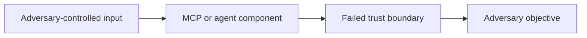

# SAF-T[XXXX]: [Technique Name]

<!--
Use this template for SAF-MCP technique documentation.

- Keep every required section, even when the current answer is "None known."
- Remove unused optional sections and all instructional comments before review.
- Use canonical ASCII identifiers such as SAF-T1001 and SAF-M-1.
- Cite empirical, time-sensitive, or externally verifiable claims inline.
- Prefer primary sources, standards, advisories, and peer-reviewed research.
-->

## Overview

- **Tactic**: [Primary Tactic (ATK-TAXXXX); Secondary Tactic (ATK-TAXXXX), if applicable]
- **Technique ID**: SAF-T[XXXX]
- **Research Packet**: [research/techniques/SAF-TXXXX](../../research/techniques/SAF-TXXXX/)
- **Documentation Status**: [Draft / Under Review / Stable / Deprecated]
- **Evidence Status**: [Observed / Demonstrated / Research-Derived / Hypothesized]
- **Severity**: [Critical / High / Medium / Low]
- **Severity Rationale**: [One sentence explaining the rating and the conditions under which it applies]
- **First Observed**: [YYYY-MM-DD and source / Not observed in production]
- **Last Updated**: [YYYY-MM-DD]

<!--
Evidence Status definitions:

- Observed: Documented in a real MCP or agentic-system incident.
- Demonstrated: Reproduced in a public proof of concept, lab, or controlled evaluation.
- Research-Derived: The end-to-end technique is inferred from independently supported components.
- Hypothesized: Technically plausible, but no direct public evidence has been identified.

"First Observed" must describe MCP or agentic-system evidence. Put historical
analogies in Evidence and Current State rather than presenting them as MCP events.
-->

## Scope

[State precisely what adversary behavior this technique covers and the security boundary it crosses.]

### In Scope

- [Behavior, mechanism, or outcome included in this technique]
- [Relevant MCP component, capability, or trust boundary]

### Out of Scope

- [Closely related behavior covered by another SAF technique]
- [Behavior that may look similar but has a different mechanism or outcome]

### Distinguishing Characteristics

[Explain how an analyst can distinguish this technique from its nearest neighbors. Name and link those techniques where appropriate.]

## Description

[Define the technique in two to four concise paragraphs. Explain the adversary objective, the MCP-specific mechanism, the affected trust boundary, and why normal platform controls may not prevent it.]

[Separate demonstrated behavior from inference. Do not place mitigation guidance or unsupported impact claims in this section.]

## Attack Vectors

- **Primary Vector**: [Principal delivery or exploitation path]
- **Secondary Vectors**:
  - [Secondary vector and when it applies]
  - [Secondary vector and when it applies]
- **Affected Components**: [MCP host, client, server, transport, tool, resource, prompt, model, memory, registry, or external service]
- **Trust Boundary Crossed**: [Boundary the adversary crosses or abuses]

## Technical Details

### Prerequisites

- [Required access, capability, configuration, or victim action]
- [Required weakness or missing control]
- [Environmental condition, if applicable]

### Attack Flow

1. **Reconnaissance or Setup**: [How the adversary identifies or prepares the opportunity]
2. **Delivery**: [How attacker-controlled input, software, identity, or state reaches the target]
3. **Trigger or Execution**: [The MCP or agent action that activates the technique]
4. **Boundary Crossing**: [The security decision, trust assumption, or control that fails]
5. **Objective**: [The immediate adversary outcome]
6. **Follow-On Activity**: [Likely persistence, escalation, collection, exfiltration, or impact]

### Example Scenario

[Describe one realistic end-to-end scenario. Identify the actor, entry point, vulnerable assumption, observable behavior, and outcome.]

```json
{
  "example": "Use a sanitized MCP message, tool definition, event, or configuration",
  "placeholder": "Do not include live credentials, destructive commands, or operational secrets"
}
```

<!--
Examples must be safe to publish. Use inert domains, placeholder credentials,
non-destructive commands, and the minimum detail needed to explain the technique.
-->

### Variants and Sub-Techniques (Optional)

<!-- Include only when variants have materially different mechanisms or observables. -->

| ID or Name | Mechanism | Distinguishing Observables |
| --- | --- | --- |
| SAF-T[XXXX].001 or [Variant Name] | [How this variant works] | [Signals unique to the variant] |

### Architecture or Attack-Flow Diagram (Optional)

<!-- Prefer a compact Mermaid diagram. Explain the security boundary in prose as well. -->



## Evidence and Current State

### Evidence Summary

<!-- Claim IDs and source IDs must match the technique research packet. -->

| Claim ID | Claim | Evidence Status | Source ID and Source | Limitations |
| --- | --- | --- | --- | --- |
| SAF-T[XXXX]-C001 | [Core technique claim] | [Observed / Demonstrated / Research-Derived / Hypothesized] | SRC-[source]: [Primary source](URL) | [What the source does not establish] |

### Current State

- **Affected Environments**: [Known products, deployment patterns, or preconditions]
- **Known Exploitation**: [Observed activity, public demonstrations, or none identified]
- **Available Protections**: [Relevant platform controls, patches, or protocol guidance]
- **Residual Risk**: [What remains possible after common protections are applied]

### Real-World Incidents or Demonstrations (Optional)

#### [Incident or Demonstration Name] ([Date])

[Describe only what the cited source establishes. Explain the connection to this technique and any important differences from the documented MCP scenario.]

## Impact Assessment

| Dimension | Rating | Rationale and Conditions |
| --- | --- | --- |
| Confidentiality | [Critical / High / Medium / Low / None] | [Data exposed and required conditions] |
| Integrity | [Critical / High / Medium / Low / None] | [State or decisions altered and required conditions] |
| Availability | [Critical / High / Medium / Low / None] | [Disruption and required conditions] |
| Scope | [Local / Adjacent / Multi-System / Ecosystem-Wide] | [Expected blast radius and limiting factors] |

### Severity Conditions

- **Severity increases when**: [Privileges, connectivity, automation, sensitive data, or missing controls]
- **Severity decreases when**: [Isolation, scoped credentials, approval gates, or other constraints]

## Detection Methods

### Required Telemetry

| Source | Events or Actions | Required Fields | Collection Notes |
| --- | --- | --- | --- |
| [MCP host/client/server audit log] | [Relevant request, response, or lifecycle event] | [Timestamp, session, actor, server, tool, arguments, result, approval state] | [Correlation or retention requirement] |
| [Identity, endpoint, network, model, or application log] | [Relevant activity] | [Fields needed by the analytic] | [Clock, normalization, or privacy considerations] |

### Indicators of Compromise (IoCs)

<!-- List durable artifacts when they exist. Do not label generic behavior as an IoC. -->

- [Artifact, identifier, file, endpoint, account, or configuration change]
- [Artifact, identifier, file, endpoint, account, or configuration change]
- [None known, if the technique produces no reliable durable artifact]

### Behavioral Indicators

- [Observable sequence or deviation that may indicate the technique]
- [Cross-source correlation that increases confidence]
- [Condition that separates suspicious behavior from normal administration]

### Detection Analytic

The standalone example analytic is maintained in [detection-rule.yml](detection-rule.yml). Do not duplicate the complete rule in this document.

- **Analytic Goal**: [What behavior the rule detects]
- **Rule Status**: [Experimental / Test / Stable]
- **Detection Logic**: [Selections, correlation, sequence, or threshold in plain language]
- **Correlation Window**: [Duration or sequence boundary, if applicable]
- **Known False Positives**: [Expected legitimate activity]
- **Known Limitations**: [Blind spots, evasion opportunities, or unavailable telemetry]
- **Tuning Guidance**: [Environment-specific thresholds, allowlists, or baselines]

### Validation

<!-- Include test assets when feasible. Otherwise document the approved waiver. -->

- **Test Data**: [test-logs.json](test-logs.json)
- **Validation Script**: [test_detection_rule.py](test_detection_rule.py)
- **Expected Result**: [Number of positive and negative cases and required outcome]
- **Last Validated**: [YYYY-MM-DD]
- **Feasibility Waiver**: [None / Specific reason representative validation is not currently possible]

## Mitigation Strategies

### Preventive Controls

1. **[SAF-M-X: Control Name](../../mitigations/SAF-M-X/README.md)**: [How the control prevents or constrains this technique]
2. **[SAF-M-X: Control Name](../../mitigations/SAF-M-X/README.md)**: [Implementation requirement or boundary]
3. **[Platform or Protocol Control]**: [Control not represented by an existing SAF mitigation, with citation]

### Detective Controls

1. **[SAF-M-X: Control Name](../../mitigations/SAF-M-X/README.md)**: [Telemetry, alerting, or review requirement]
2. **[SAF-M-X: Control Name](../../mitigations/SAF-M-X/README.md)**: [How the control increases detection confidence]

### Response Procedures

#### Immediate Actions

- [Contain the session, identity, server, tool, or affected resource]
- [Revoke or rotate exposed credentials where applicable]

#### Investigation Steps

- [Preserve and correlate the required telemetry]
- [Determine entry point, affected scope, and follow-on activity]

#### Remediation

- [Remove the root cause or unsafe configuration]
- [Restore affected state and validate recovery]
- [Add regression coverage or monitoring for recurrence]

## Related Techniques

| Technique | Relationship | Distinction |
| --- | --- | --- |
| [SAF-TXXXX: Technique Name](../SAF-TXXXX/README.md) | [Prerequisite / Alternative / Co-occurring / Follow-On / Overlapping] | [Why the techniques are related but not duplicates] |
| [SAF-TXXXX: Technique Name](../SAF-TXXXX/README.md) | [Relationship] | [Boundary between the techniques] |

## MITRE ATT&CK Mapping

<!--
Use Direct only when the SAF behavior meets the ATT&CK technique definition.
Use Analogous when ATT&CK provides the closest conceptual match. Do not map
solely because two techniques share an impact or tactic.
-->

| ATT&CK ID | Technique | Mapping Type | Rationale |
| --- | --- | --- | --- |
| [TXXXX](https://attack.mitre.org/techniques/TXXXX/) | [ATT&CK Technique Name] | [Direct / Analogous] | [Behavioral correspondence and important limitations] |

### Additional Framework Mappings (Optional)

| Framework | ID | Name | Rationale |
| --- | --- | --- | --- |
| [MITRE ATLAS / OWASP / NIST / Other] | [Identifier] | [Control or technique name] | [Why the mapping applies] |

## References

<!--
List every source cited in the body and only sources materially used.
Prefer stable, direct URLs. Include publication date and access date when useful.
-->

1. **SRC-[source]**: [Model Context Protocol Specification](https://modelcontextprotocol.io/specification) - [Relevant section and claim supported]
2. **SRC-[source]**: [Primary source title - Author or Organization, Year](URL) - [Claim supported]
3. **SRC-[source]**: [Additional source title - Author or Organization, Year](URL) - [Claim supported]

## Version History

| Version | Date | Changes | Author |
| --- | --- | --- | --- |
| 0.1 | [YYYY-MM-DD] | Initial draft | [Name or handle] |
